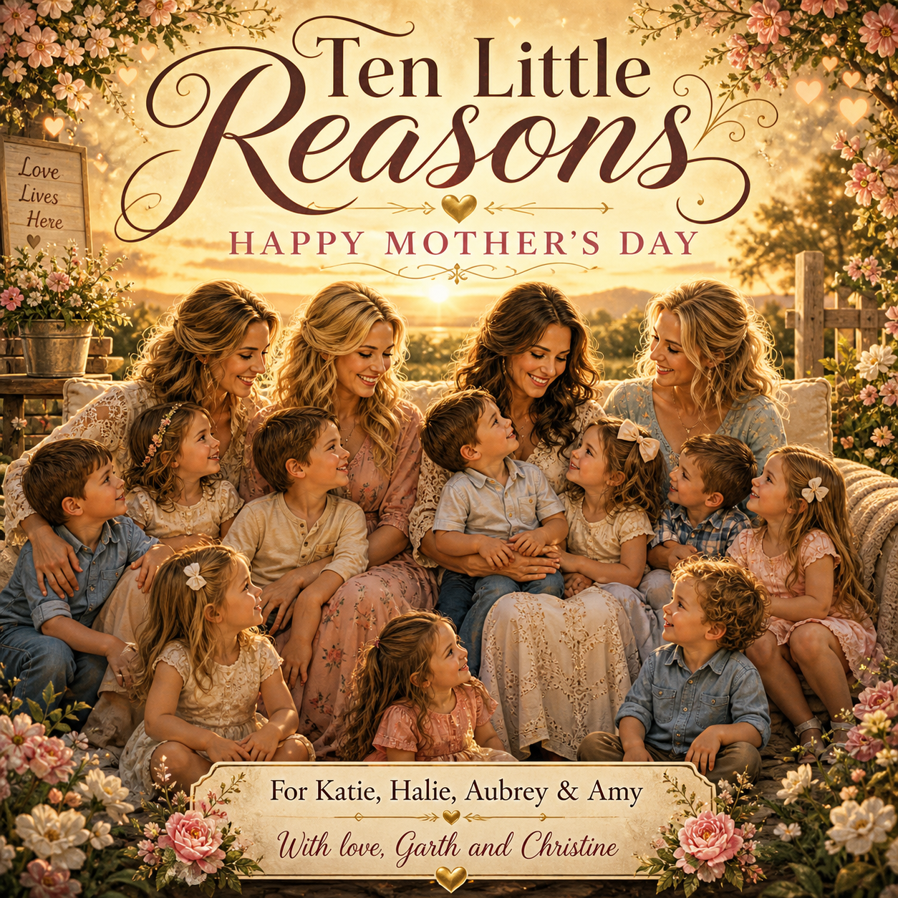

# Ten Little Reasons

**A Mother’s Day song, video, and cover-art project for Katie, Halie, Aubrey, and Amy**  
**From Garth and Christine**



## Project Description

**Ten Little Reasons** is a heartfelt Mother’s Day tribute created by **Garth and Christine** for **Katie, Halie, Aubrey, and Amy**, the loving mothers of their ten grandchildren. This project includes a personalized Mother’s Day song, Suno-style lyrics, an MP3 audio file, an MP4 video file, and custom cover art celebrating the love, patience, strength, and care these mothers give every day.

This is a family keepsake made with gratitude, appreciation, and love.

## Listen or Watch

- **Song MP3:** [`media/ten-little-reasons.mp3`](media/ten-little-reasons.mp3)
- **Video MP4:** [`media/ten-little-reasons.mp4`](media/ten-little-reasons.mp4)
- **Cover Art:** [`assets/ten-little-reasons-cover.png`](assets/ten-little-reasons-cover.png)

## Dedication

To **Katie, Halie, Aubrey, and Amy**:

Thank you for everything you do for our family and for the love you give to our ten grandchildren. You are appreciated more than words can say.

With love,  
**Garth and Christine**


## Lyrics

```text
Ten Little Reasons

[Verse 1]
There are ten little reasons our hearts are so full
Ten precious smiles that make life beautiful
Ten little voices, ten hearts full of light
Ten little blessings that make everything right

You are the mothers who guide them each day
Through laughter and tears, through work and play
With every soft hug and every prayer said
You give them a home where love is always spread

[Pre-Chorus]
Katie, Halie, Aubrey, and Amy too
We see all the love that shines through you
The patience, the strength, the care that you give
You show those children the right way to live

[Chorus]
Happy Mother’s Day to each one of you
For all of the beautiful things that you do
You are the heart of the family we see
The love in the branches of our family tree

From Garth and Christine, with love deep and true
We are so thankful for each one of you
Ten little reasons make our hearts say
You deserve love this Mother’s Day

[Verse 2]
You wipe little tears and calm little fears
You hold them close through all of the years
You teach them kindness, courage, and grace
And give them comfort in your warm embrace

Some days are easy, some days are long
But somehow you keep standing strong
You give them your time, your heart, and your best
And because of your love, they are truly blessed

[Pre-Chorus]
Katie, Halie, Aubrey, and Amy, we know
Your love is the reason those children grow
Behind every smile and every sweet face
Is a mother’s love no one can replace

[Chorus]
Happy Mother’s Day to each one of you
For all of the beautiful things that you do
You are the heart of the family we see
The love in the branches of our family tree

From Garth and Christine, with love deep and true
We are so thankful for each one of you
Ten little reasons make our hearts say
You deserve love this Mother’s Day

[Bridge]
We may not say it enough, but we hope that you know
How much your love continues to show
In every child’s laugh, in every bright eye
Your love is the reason their dreams can fly

You are appreciated, honored, and loved
A blessing to this family from heaven above
Today we celebrate the mothers you are
Each one of you shines like a beautiful star

[Final Chorus]
Happy Mother’s Day to each one of you
For all of the beautiful things that you do
You are the heart of the family we see
The love in the branches of our family tree

From Garth and Christine, with love deep and true
We are so thankful for each one of you
Ten little reasons make our hearts say
You deserve love this Mother’s Day

[Outro]
Katie, Halie, Aubrey, and Amy, this is for you
With all of our love and gratitude too
For ten little blessings and the love you display
We wish you a beautiful Happy Mother’s Day

With all our love
Garth and Christine
```


## Files Included

```text
README.md
PROJECT_DESCRIPTION.md
index.html
assets/ten-little-reasons-cover.png
lyrics/ten-little-reasons-lyrics.txt
suno/suno-style-prompt.txt
media/ten-little-reasons.mp3
media/ten-little-reasons.mp4
```

## GitHub Pages

This project includes a simple `index.html` page. After uploading the repository to GitHub, you can turn on GitHub Pages from the repository settings to make the tribute page viewable online.

## Author

**Logan Garth Goodwin**  
Created with love from **Garth and Christine**.
